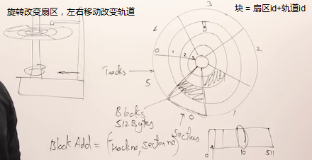
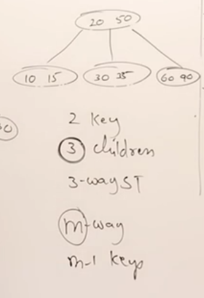
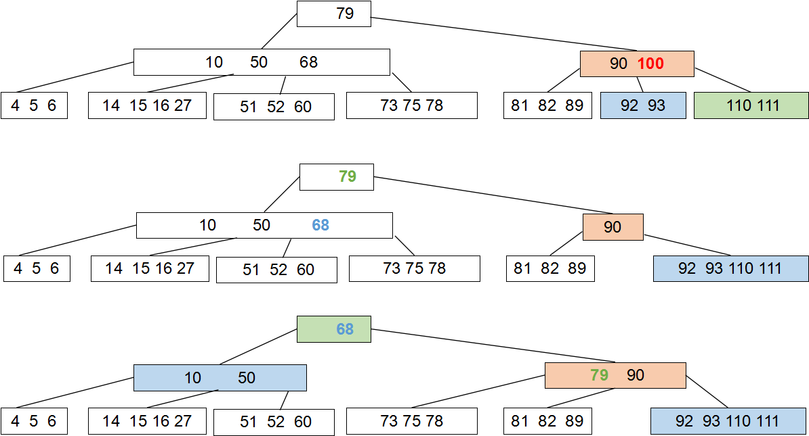
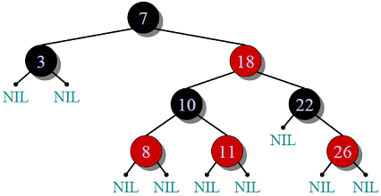

[TOC]

# 树 

本文所有代码地址：https://github.com/LittleWhiteMouse/Tree

## 基本概念

**引入原因**：树可以兼顾数组和链表的搜索和插入特性。

**度**:一个节点有几个子节点

**叶子**:无子节点的节点

**树的度**：所有节点最大的度

**层数**：根在第一层

**深度**：从根到某节点的节点总数

**高度**：从当前节点到最远叶子节点的节点总数

某结点的深度+该结点的高度 = 树的高度

**有序树**：将同一个父的子结点编号，确定其次序的树

**无序树**：树种任意节点的子节点之间没有顺序关系

**连通图**：节点之间均有路径，树是无环连通图！

所有的树都可以用二叉树表示，只要将长子兄弟表示法的结构旋转45°

#### 二叉树性质

- 对于任一非空二叉树，如果叶子节点个数为n0,度为2的节点个数为n2，则n0 = n2+1
  - 推导过程：假设度为1的节点个数为n1，二叉树的总结点数为n = n0+n1+n2, 二叉树的边数T = n1+2*n2 = n-1 = n0+n1+n2-1,左右移动得到结论。

#### 二叉树分类

- **真二叉树**：所有节点的度要么为0，要么为2，即没有只有一个子节点的节点
- **满二叉树**：所有节点的度要么为0，要么为2，且所有叶子节点都在最后一层。
- **完全二叉树**：按层填满，最后一层都从左往右填。假设树的高度是h,树的总结点数量是n，h = floor(log2(n))
  - 例题：已知完全二叉树有768个结点，求叶子节点的个数。答：设叶子节点个数为n0,度为1的节点的个数为n1,度为2的节点个数为n2。总结点个数n = n0+n1+n2，而且n0=n2+1,所以n = n1+2*n0-1.若是完全二叉树，n1是0或者1.n是偶数，所以n1是1，n0=768/2=384。

## 无序树的构建和遍历

#### BinTree.h

```cpp
#pragma once
#include <queue>

template <class T>
class BinNode {
public:
	T data;
	BinNode<T> *left, *right;
	BinNode() { left = right = nullptr; }
	BinNode(const T&e, BinNode<T>*l = nullptr, BinNode<T>*r = nullptr) {
		data = e; left = l; right = r;
	}
};

template <class T>
class BinTree
{
protected:
	BinNode<T> *root;
	
public:
	BinTree() { root = nullptr; }
	BinTree(BinNode<T> *r) { root = r; }
	~BinTree() {}

	void visit(BinNode<T> *node) { std::cout << node->data << " "; }

	//前序遍历
	void preOrder() { preOrder(root); }
	void preOrder(BinNode<T>*curnode) {
		if (curnode)
		{
			visit(curnode);
			preOrder(curnode->left);
			preOrder(curnode->right);
		}
	}

	//中序遍历
	void midOrder(){ midOrder(root); }
	void midOrder(BinNode<T> *curnode) {
		if (curnode)
		{
			midOrder(curnode->left);
			visit(curnode);
			midOrder(curnode->right);
		}
	}
	
	// 后序遍历
	void postOrder() { postOrder(root); }
	void postOrder(BinNode<T>*curnode) {
		if (curnode)
		{
			postOrder(curnode->left);
			postOrder(curnode->right);
			visit(curnode);
		}
	}

	// 层序遍历：申请一个新的队列，将头节点压入队列
	// 每次从出队，打印node值，如果左孩子不为空，左孩子入队,如果有孩子不为空，右孩子入队
	// 直到队列为空
	void levelOrder() {
		std::queue<BinNode<T>*> q;
		BinNode<T> * curnode = root;
		while(curnode)
		{
			visit(curnode);
			if (curnode->left) { q.push(curnode->left); }
			if (curnode->right) { q.push(curnode->right); }
			if (q.empty()) return;
			curnode = q.front(); 
			q.pop();
		}
	}
};
```

#### 测试代码main.cpp

```cpp
#include <iostream>
#include "BinTree.h"
using namespace std;

int main() {
	BinNode<char> A('A'), B('B'), C('C'),D('D'), E('E'),F('F'),G('G'),H('H'),I('I');
	A.left = &B; A.right = &C;
	B.left = &D;
	C.left = &E; C.right = &F;
	D.left = &G; D.right = &H;
	E.right = &I;

	BinTree<char> tree(&A);
	cout << "先序遍历："; tree.preOrder(); cout << endl;
	cout << "中序遍历："; tree.midOrder(); cout << endl;
	cout << "后序遍历："; tree.postOrder(); cout << endl;
	cout << "后序遍历："; tree.levelOrder(); cout << endl;
	
	system("pause");
	return 0;
}
```

## BST二叉查找树

二叉查找树 BST（Binary Search Tree）

- 每一个元素都有key，而且不允许重复
- 左子树的key都小于根结点的key
- 右子树的key都大于根节点的key
- 左右子树都是二叉查找树
- 树在查找和删除数据的时候都是二分操作 log(N)
- 二叉搜索树的**中序遍历**是按照从小到大排序的！！！
- 缺点：如果数据直接是按照排序后的顺序插入，二叉查找树会退化为链表！！！根本的原因在于二叉查找树不会自动平衡，无法动态选择根节点。

#### BSTree.h

```cpp
#pragma once
#include<iostream>
enum Boolean { FALSE, TRUE }; //自定义布尔类

template<class T>
class Element {  //可以添加更多的数据，灵活调整
public:
	T key;
};

template <class T> class BSTree; //加入BSTree的声明，防止在声明友元时出错

template<class T>
class BSNode {
	friend class BSTree<T>; //将BSTree作为友元使之可以访问私有成员
public:
	Element<T> data;
	BSNode<T> *left;
	BSNode<T> *right;
	void display(int i);
};

template <class T>
class BSTree
{
private:
	BSNode<T> *root;
public:
	BSTree(BSNode<T>*init = nullptr) { root = init; }
	~BSTree() {
		clear(root); root = nullptr;
	}
	void clear(BSNode<T>*node);
	Boolean Insert(const Element<T> &data);
	BSNode<T> *Search(const Element<T> &data);
	BSNode<T> *Search(BSNode<T>*, const Element<T> &data);
	BSNode<T> *IterSearch(const Element<T>&data);
	BSNode<T> *remove(Element<T> &data);
	BSNode<T> *remove(BSNode<T> *node, Element<T> &data);
	void MidOrder();
	void MidOrder(BSNode<T>* node);
	void display();
};

template<class T>
void BSTree<T>::clear(BSNode<T>* node) {
	if (node){
		clear(node->left);
		clear(node->right);
		delete node;
		node = nullptr;
	}
}

template <class T>
void BSNode<T>::display(int i)
{
	std::cout << "Position: " << i; // i是结点的位置，按照层序遍历往下数
	std::cout << "   DataKey: " << data.key << std::endl;  // 显示数据
	if (left) left->display(2 * i);
	if (right) right->display(2 * i + 1);
}

template<class T>
Boolean BSTree<T>::Insert(const Element<T> &data) {
	BSNode<T> *p = root;       // 当前节点
	BSNode<T> *q = nullptr;    // 用于指向当前节点的父节点
	//insert之前需要先查找
	while (p) {
		q = p; //每次改变p之前，用q记录
		if (data.key == p->data.key) return FALSE;//插入失败
		else if (data.key < p->data.key) { p = p->left; }//向左
		else p = p->right; //向右
	}
	//当循环结束后找到的位置为q
	p = new BSNode<T>;
	p->left = p->right = nullptr;
	p->data = data;
	if (!root) root = p;
	else if (data.key < q->data.key) q->left = p;
	else q->right = p;
	return TRUE;//表示插入成功
}

template <class T>
BSNode<T> * BSTree<T>::remove(Element<T> &data) {
	root = remove(root, data);
	return root;
}

// 删除结点 并 返回被删除的节点
template<class T>
BSNode<T> * BSTree<T>::remove(BSNode<T> *node, Element<T> &data) {
	if (node == nullptr) return node;
	if (data.key < node->data.key)
		node->left = remove(node->left, data);
	else if (data.key > node->data.key)
		node->right = remove(node->right, data);
	else
	{ //找到了待删除结点
		if (node->left != nullptr &&  node->right != nullptr) //若待删除结点度为2
		{
			BSNode<T> * maxleft = node->left; //去找左子树的最大值替换待删除结点
			while (maxleft->right != nullptr)
			{
				maxleft = maxleft->right;
			}
			node->data = maxleft->data; // 替换
			node->left = remove(node->left, data); // 删除最大结点
		}
		else // 待删除结点的度是0或者1
		{
			BSNode<T> *temp = nullptr;
			if (node->left == nullptr) {
				temp = node->right;
				delete node;
				return temp;
			}
			else if(node->right == nullptr)
			{
				temp = node->left;
				delete node;
				return temp;
			}
		}
	}
	return node;
}


template<class T>
void BSTree<T>::display() {
	if (root) {
		root->display(1);
	}
	else std::cout << "empty tree\n";
}

// 递归的查找
template<class T>
BSNode<T>* BSTree<T>::Search(const Element<T> &data) {
	return Search(root, data);
}
template<class T>
BSNode<T>* BSTree<T>::Search(BSNode<T>* node, const Element<T> &data) {
	if (!node) return nullptr;
	if (node->data.key == data.key) return node;
	else if ((node->data.key < data.key))
	{
		return Search(node->right, data);
	}
	else
	{
		return Search(node->left, data);
	}
}

//迭代的查找
template<class T>
BSNode<T>* BSTree<T>::IterSearch(const Element<T>&data) {
	for (BSNode<T>*node = root; node;)
	{
		if (node->data.key == data.key) return node;
		else if (node->data.key < data.key) node = node->right;
		else node = node->left;
	}
}

template <class T>
void BSTree<T>::MidOrder() {
	MidOrder(root);
}

template <class T>
void BSTree<T>::MidOrder(BSNode<T>* node) {
	if (!node) return;
	MidOrder(node->left);
	std::cout << node->data.key << std::endl;
	MidOrder(node->right);
}
```

#### main.cpp

```cpp
#include<iostream>
#include "BSTree.h"
using namespace std;

int main(int argc, char**argv) {
	BSTree<int> tree;
	Element<int> a, b, c, d, e, f, g, h;
	a.key = 5; b.key = 3; c.key = 11;
	d.key = 3; e.key = 15; f.key = 2;
	g.key = 8; h.key = 22;

	tree.Insert(a); tree.Insert(b); tree.Insert(c); tree.Insert(d);
	tree.Insert(e); tree.Insert(f); tree.Insert(g); tree.Insert(h);

	tree.display();
	BSNode<int> *p = tree.Search(g);
	cout << "finding result = " << p->data.key << endl;
	BSNode<int> *p2 = tree.IterSearch(g);
	cout << "finding result = " << p2->data.key << endl;
	cout << "----------------------" << endl;
	tree.MidOrder();
	cout << "delete b=3 " << endl;
	tree.remove(b);
	tree.MidOrder();
	cout << "delete f=2" << endl;
	tree.remove(f);
	tree.MidOrder();
	cout << "delete e=15 " << endl;
	tree.remove(e);
	tree.MidOrder();
	system("pause");
	return 0;
}
```

## AVL平衡二叉查找树：自平衡

基本：Adelson -Velsky-Landis树

平衡：节点数量固定时，左右子树的高度越接近，树越平衡

平衡因子： 某结点的左右子树的高度差

AVL树的特点 : 每个结点的平衡因子只可能是1、0、-1，否则失衡

添加结点，令AVL失衡：最坏的情况：可能会导致所有祖先结点失衡。父节点和非祖先结点都不可能失衡,只有G以上的所有祖先结点会失衡

#### AVL树失衡的四种姿态

##### LL : 右旋g：g的左孩子的左子树导致失衡


##### RR : 左旋g：g的右孩子的右子树导致失衡


##### LR : 左旋p+右旋g = RR+LL


##### RL : 右旋p+左旋g  = LL+RR


#### AVL树的添加操作

##### 一、大致思路

1. 将插入结点 w 视作标准BST插入
2. 从w开始，向上移动，找到第一个不平衡结点，g，由此确定p和n。注意：此处向上查找的方法用的是递归！！！
3. 修复g，使之平衡（令其高度和插入之前的高度一致）, gpn的排列方式分为四种情况
   - LL：右旋g
   - LR：左旋p+右旋g
   - RR：左旋g
   - RL：右旋p+左旋g

##### 二、具体实现流程

- 执行正常的BST插入
- 当前节点一定是新插入节点的祖先，更新当前节点的高度
- 获取当前节点的平衡因子
- 若平衡因子大于1，则失衡，处于LL或者LR的情况，通过比较插入结点和左子树根结点的大小可以确定LL和LR
- 若平衡因子小于-1，则失衡，处于RR或者RL的情况，通过比较插入结点和右子树根结点的情况可以确定RR或者RL的情况。

##### 三、实际例子：


- 


#### AVL树的删除操作

##### 一、大致思路

1. 对要删除结点w进行标准BST删除

2. 从w开始，向上移动找到第一个不平衡结点g，则可同时找到对应的结点pn,注意，此处的pn和插入处不同

3. 调整g使之平衡。分为四种情况LL、LR、RR、RL.但是即使g平衡之后其祖先也不一定平衡（因为平衡后的高度不是原来的高度了），这与插入的情况不同，因此还需要往上修复g的祖先，直到根结点为止，比如这种情况：


##### 二、具体流程

1. 执行正常的BST删除
   1. 找到待删除结点
   2. 若待删除结点的度为2，则找到待删除结点的右子树的最小值来替换待删除结点，并删除掉被替换的节点
   3. 若待删除结点的为0或1，删除待删除结点
2. 更新当前节点的高度，这里的当前节点指的是所有待删除结点的祖先。注意，对于空节点无法也无需更新高度
3. 获取当前节点的平衡因子验证是否失衡
4. 若平衡因子>1,则处于左侧失衡情况，可以分为LL和LR，通过获取左子树的平衡因子>=0,为LL,否则为LR
5. 若平衡因子<-1,则处于右侧失衡情况，可以分为RR和RL，通过获取右子树的平衡因子>0,为RL，否则为RR。 注意，平衡因子=0的情况适用于RR和LL。

#### AVLTree.h

```cpp
#pragma once
#include<iostream>
template<class T>
class AVLNode {
public:
	T key;
	int height;
	AVLNode * left;
	AVLNode * right;
	AVLNode(T value, AVLNode *l, AVLNode *r) :
		key(value), height(0), left(l), right(r) {}
};

template<class T>
class AVLTree
{
public:
	AVLTree():root(nullptr){}
	AVLTree(AVLNode<T> *r) :root(r) {}
	~AVLTree() { clear(root); root = nullptr; }
	int height();                 // 获取树的高度
	AVLNode<T> * insert(T key);
	AVLNode<T> * remove(T key);

	// 删除AVL树
	void clear(AVLNode<T> *root);

	void preOrder();
	void midOrder();
	void postOrder();

private:
	AVLNode<T> *root;
	int height(AVLNode<T> *node); // 获取结点的高度
	int max(int a, int b);
	int getBalance(AVLNode<T> *node); // 获取平衡因子

	// 自平衡的四种方式
	AVLNode<T> *  LLrotation(AVLNode<T>* node);
	AVLNode<T> *  RRrotation(AVLNode<T>* node);
	AVLNode<T> *  LRrotation(AVLNode<T>* node);
	AVLNode<T> *  RLrotation(AVLNode<T>* node);

	// 插入结点
	AVLNode<T> * insert(AVLNode<T> * root, T key);
	// 删除节点
	AVLNode<T> * remove(AVLNode<T> *root, T key);

	void preOrder(AVLNode<T> *node);
	void midOrder(AVLNode<T> *node);
	void postOrder(AVLNode<T> *node);
};

/**********************获取AVL树的高度*******************/
template<class T> int AVLTree<T>::height(AVLNode<T> *node){
	if (node == nullptr) return 0;
	return node->height;
}
template<class T> int AVLTree<T>::height() {
	return height(root);
}
/**********************获取AVL结点的平衡因子*******************/
template<class T> int AVLTree<T>::getBalance(AVLNode<T>*node) {
	if (node == nullptr) return 0;
	return height(node->left) - height(node->right);
}
/**********************更新结点比较大小*******************/
template<class T> int AVLTree<T>::max(int a, int b) {
	return (a > b) ? a : b;
}

/************AVL树失衡的四种姿态对应的自平衡的方式***********/
template<class T> AVLNode<T> * AVLTree<T>::LLrotation(AVLNode<T>* g) {
	// 右旋祖父结点，让祖父结点下去
	// g:祖父结点(失衡结点) p:父结点 
	AVLNode<T> *p = g->left;
	g->left = p->right;
	p->right = g;
	// 更新结点高度
	g->height = 1+max(height(g->left), height(g->right));
	p->height = 1+max(height(p->left), height(p->right));

	return p;
}
template<class T> AVLNode<T> * AVLTree<T>::RRrotation(AVLNode<T> *g) {
	// 左旋祖父结点，让祖父结点下去
	// g:祖父结点(失衡结点) p:父结点 
	AVLNode<T> *p = g->right;
	g->right = p->left;
	p->left = g;
	// 更新结点高度
	g->height = 1 + max(height(g->left), height(g->right));
	p->height = 1 + max(height(p->left), height(p->right));

	return p;
}
template<class T> AVLNode<T> * AVLTree<T>::LRrotation(AVLNode<T> *g) {
	// 左旋p + 右旋g = RR + LL
	// g:祖父结点(失衡结点) p:父结点 
	g->left = RRrotation(g->left);
	return LLrotation(g);
}
template<class T> AVLNode<T> * AVLTree<T>::RLrotation(AVLNode<T> *g) {
	// 右旋p + 左旋g = LL + RR
	// g:祖父结点(失衡结点) p:父结点 
	g->right = LLrotation(g->right);
	return RRrotation(g);;
}

/**********************AVL 结点插入*******************/
template<class T> AVLNode<T> * AVLTree<T>::insert(AVLNode<T> * node, T key) {
	// 1. 执行标准BST插入操作
	if (node == nullptr)
		return new AVLNode<T>(key, nullptr, nullptr);
	else if (key < node->key)
		node->left = insert(node->left, key);
	else if (key > node->key)
		node->right = insert(node->right, key);
	else
		return node;// 不允许插入重复结点
	
	// 2. 更新该祖先节点的高度
	node->height = max(height(node->left), height(node->right)) + 1;

	// 3. 获取平衡因子，并判断是否失衡
	int balance = getBalance(node);
	// 4. 若失衡，则判断四种失衡情况
	if (balance > 1 && key < node->left->key) return LLrotation(node);
	if (balance > 1 && key > node->left->key) return LRrotation(node);
	if (balance < -1 && key > node->right->key) return RRrotation(node);
	if (balance < -1 && key < node->right->key) return RLrotation(node);

	return node;
}  

template<class T> AVLNode<T> * AVLTree<T>::insert(T key) {
	root =  insert(root, key);
	return root;
}

/**********************AVL 删除树*******************/
template<class T> void AVLTree<T>::clear(AVLNode<T> *node) {
	if (node != nullptr) {
		clear(node->left);
		clear(node->right);
		delete node;
		node = nullptr;
	}
}

/**********************AVL 结点删除*******************/
template <class T> AVLNode<T> * AVLTree<T>::remove(T key) {
	root = remove(root, key);
	return root;
}

// 删除结点 并 返回被修正子树的根结点
template<class T> AVLNode<T> * AVLTree<T>::remove(AVLNode<T> *node, T key) {
	// 1. 执行标准BST删除
	if (node == nullptr) {
		std::cout << "结点不存在，无法删除\n";
		return nullptr;
	}
	if (key < node->key){
		node->left = remove(node->left, key);
	}
	else if (key > node->key) {
		node->right = remove(node->right, key);
	}
	else{
		// 找到了要被删除的节点，开始分类讨论
		// 若删除结点的度为2
		if (node->left != nullptr && node->right != nullptr) {
			// 找到待删除结点的右子树的最小值来替换待删除结点
			AVLNode<T> * minright = node->right;
			while (minright->left){
				minright = minright->left;
			}
			node->key = minright->key;  // 替换待删除结点
			node->right = remove(node->right, minright->key); // 删除被替换的结点
		}
		else // 若待删除结点的度为0或1,删除待删除结点
		{   
			// 并将node设置成为非空子节点（度为1）
			// 或者设为空指针（度为0）
			AVLNode<T> * temp = node;
			node = node->left ? node->left : node->right;
			delete temp;
		}
	}

	// 2. 更新当前节点的高度
	if (node == nullptr) return nullptr; //对于空节点无法也无需更新高度
	node->height = 1 + max(height(node->left), height(node->right));

	// 3. 获取当前节点的平衡因子，验证是否失衡
	int balance = getBalance(node);
	// 4. 恢复平衡的四种情况
	if (balance > 1) {  //左侧失衡情况，可以分为LR,LL
		if (getBalance(node->left) >= 0) return LLrotation(node);
		else return LRrotation(node);
	}
	if (balance < -1) { // 右侧失衡情况，可以分为RL,RR
		if (getBalance(node->right) > 0) return RLrotation(node);
		else return RRrotation(node);
	}
	return node;
}

/**********************树的各种遍历*************************************/
template<class T> void AVLTree<T>::preOrder(AVLNode<T> *node) {
	if (node) {
		std::cout << node->key << " "; preOrder(node->left); preOrder(node->right);
	}
}

template<class T> void AVLTree<T>::midOrder(AVLNode<T> *node) {
	if (node){
		midOrder(node->left); std::cout << node->key << " "; midOrder(node->right);
	}	
}

template<class T> void AVLTree<T>::postOrder(AVLNode<T> *node) {
	if (node) {
		postOrder(node->left); postOrder(node->right); std::cout << node->key<<" ";
	}
}
template<class T> void AVLTree<T>::preOrder() { preOrder(root); }
template<class T> void AVLTree<T>::midOrder() { midOrder(root); }
template<class T> void AVLTree<T>::postOrder() { postOrder(root); }
```

#### 随机测试代码main.cpp

```cpp
#include<iostream>
#include<time.h>
#include<vector>
#include "AVLTree.h"
using namespace std;

int main(int argc, char**argv) {
	srand((int)time(0));
	AVLTree<int> tree;
	int times = rand()%20; //随机生成树的节点数量
	int copytimes = times;
	vector<int> arr;
	while (copytimes--)
	{
		int val = rand() % 100;
		arr.push_back(val);
		tree.insert(val); // 随机插入任意节点的大小，范围定在0~99之间
	}
	tree.midOrder();
	cout << "**************" << endl;
	while (times--)
	{
		int todel = rand() % arr.size();
		cout << "\n try to del " << arr[todel] << endl;
		tree.remove(arr[todel]);
		cout << " the result is ";
		tree.midOrder();
	}
	cout << "\n***********" << endl;
	system("pause");
	return 0;
} 
```


## B树：自平衡

B树是一种平衡的多路搜索树,(多叉树),多用于文件系统,数据库的实现，可以减少磁盘访问次数。

### 一、为什么要有B树?

##### 磁盘结构

一个圆可以根据扇区划分，也可以根据圆环轨道划分。块id = 扇形id + 轨道id。块有固定大小，比如为512Bytes，则可以通过块中的下标定义到任何一个字节的位置。




假设数据库内的一条信息是128bytes，则一个大小为512bytes的块可以存储4条信息。100条数据库信息一共需要25个块。


在查找信息的时候，必须要遍历25个块。这个时间是可以减小的，只要给当前数据库增加一个索引表，表内存放id和指针信息，假设每条信息在索引表中的大小为16，则一个块一共可以存储512/16 = 32条信息,那么100条信息需要100/32~=4个块信息来存储索引表，算上需要访问的信息条一共需要访问4+1个块。   如果扩大记录条数为1000，索引表占据的块数会更多，变为需要40个块，这40个块的索引会需要很多时间，则可以通过创建索引表的索引表来加速查找。比如创建新的索引表，每个索引表中存放每个块的首id和地址，则只需要2个块就存储检索标的检索表（也就是稀疏表）。


综上，可以通过多层索引来加速检索速度，如图所示，这就是B树和B+树的基础 。 B树中，所有的结点都有多路指针指向数据库中的元素


##### M-way搜索树

一个结点中可以有n个key，每个结点可以有n+1个数量的子节点 。m-way搜索树用m=n+1表示去往子节点的路数。



M-way搜索树存在的问题，比如对于10-way搜索树，有10,20,30三个key,当插入这三个节点时，很可能会出现如下这种糟糕情况，因为M-way搜索树没有插入规则。B树就是加上了这些规则的M-way搜索树


比如规定了除根结点外的所有非叶节点要求必须填满一半，才能创建孩子节点，这样就可以消除m-ways树的问题


### 二、B树的规则

B树的规则有两个版本：规定最小度的版本从keys角度来考虑，数据清晰些；规定阶数的版本从nodes角度来考虑，易于理解些。

**规定B树的最小度为 t** ：从keys角度来考虑

- 所有结点**最多**有 2t-1 个keys，也就是最多有 2t 个childnodes.

- 非根结点**至少**有 t-1 个keys，也就是至少有 t 个childnodes. 若树非空，根至少有1个keys.
- 一个结点的childnodes数量 =  keys数量 + 1

**规定B树的阶数为 m** ： 从nodes角度来考虑

-  阶数 m 表示每个结点**最多**有 m 个childnodes 
- 非根结点的childnodes为k, 则m/2 <= k <= m（要求必须填满一半，才能创建孩子节点，也就是非叶节点至少有ceil(m/2)-1个keys）

- 根结点最少有2个childnodes（如果不是叶子节点）
- 所有叶子都在同一层
- 从下至上插入

举个例子： 当 t = 2 ：所有结点最多可以有4个孩子，非根结点至少有2个孩子，因此非根结点的孩子数有2，3，4三种可能，被称为**2-3-4树**。

##### 2.1 B树的查找

从根结点开始查找 k ，设置一个下标 i=0，通过比较大小，确定 k 在该结点中的下标范围，设size为当前节点拥有的keys数量。

- 如果 i < size，并且能找到 k== node->keys[i], 则找到
- 否则，如果该结点为叶子节点，那就是没有
- 再否则，k就处在keys[i-1]和keys[i],相邻两个keys之间，需要继续递归向下遍历。

##### 2.2 B树的遍历

从最左边的孩子开始，递归地打印最左边的孩子，然后对剩余的childnodes和keys重复相同的过程。最后递归打印最右边的孩子

##### 2.3 B树的插入

###### 方法一：

类似BST，从根开始向下遍历到叶节点。到达leaf后，将key插入到childnodes。问题在于childnodes中可容纳的keys是固定的，在插入新的key时必须要保证childnodes有足够的空间可以容纳key，这可以通过在插入前分裂结点来实现。

**因此，要插入key,则需要从root开始遍历到 leaf, 在遍历时检查该node是否满了，如果满员，就分裂结点来创造空间。缺点是：可能会进行不必要的拆分**

###### 具体步骤

- 


###### 例子


###### 方法二：

- 找到应添加X的叶节点
- 将X添加到已有值之间的适当位置。作为叶节点，无需担心子树
- 若添加X之后，节点中的keys数量<=2*t-1,则没有问题。否则节点溢出，开始分裂结点，将结点分为三部分
  - 原结点存放左边 t-1 个 keys
  - 新建结点存放右边 t-1 个 keys
  - 中间key被放到父节点上

- 判读父节点是否溢出，直到没有溢出发生


###### 例子

创建4阶B树，结点为10,20,40,50,60,70,80，30，35，5，15


简单地说，就是在放满的情况下，抽出一个放到上面，其他数据分为两块。存40的结点是在50插入之后创建的，所以说B树是从下往上建立的

继续加60，70，加到80有了变化


继续加30，加到35有了变化


继续加5，加到15有了变化


##### 2.4 B树的删除：

###### 分类讨论

- 如果被删除的key在leaf中

  - 若leaf中的 n > t-1，直接删除

  - 若leaf中的 n = t-1,

    - “借”：若两个相邻左右兄弟结点中有一个是n>t-1的，就从兄弟结点借，借的方式是当前节点从父节点拿一个，父节点从兄弟结点拿一个
    - “合并”：若两个相邻左右兄弟都是n = t -1,则将该leaf、左兄弟
      （或有兄弟）、父中的中间key合并成一个结点，并删除key
    - “单边”：对于边缘上的leaf，则只考虑一边结点是否满足n>t-1的条件，满足：借，不满足：合并

    注意：在合并之后，父节点会少一个key，若合并后父节点n<t-1，需要对父节点进行重复借或者合并的操作

- 如果被删除的key在中间结点中

  - 若前驱结点为根的子树中找到最大值，或者从后继结点为根的子树中找到了最小值，并且这个值所在叶子结点的 n>t-1，则这个值和key交换，然后直接删除key
  - 若前驱和后继找到的叶子结点都满足 n = t-1，则合并前驱和后继，并删除key
  
- 在实际的操作中，先给让结点膨胀在删除以保证平衡。

-----

###### 例子

原图


---------

 若leaf中的n > t-1，直接删除       

>  删除65：n >t-1, 直接删除


----

若leaf中的 n = t-1, 若左右兄弟结点中有一个是n>t-1的，就从兄弟结点借，借的方式是当前节点从父节点拿一个，父节点从兄弟结点拿一个。

> 删除23，n = t-1, left sibling n > t-1,从 left sibling 拿一个
>
> 删除72，n = t-1, right sibling n > t-1,从right sibling 拿一个


---

若leaf中的n = t-1, 若左右两兄弟都是n = t-1,则任意选择一个兄弟与之合并，还有父节点中介于两个结点之间的那个key，一起合并，然后删除待删除的节点

> 删除64， n=t-1,left&right n = t-1, merge(this,leftsibling), delete key


---

leaf位于父节点边缘的情况处理也类似，只是借或者合并的选择只能是单边而已。如果合并之后父节点的n<t-1则需要对父节点进行重复操作。


-----------------------

如果被删除的key在中间结点中

- 若前驱结点为根的子树中找到最大值，或者从后继结点为根的子树中找到了最小值，并且这个值所在叶子结点的 n>t-1，则这个值和key交换，然后直接删除key

  > 删除 70 ,95,对应的前驱和后继n > t-1， 则交换并直接删除

  


- 若前驱和后继找到的叶子结点都满足 n = t-1，则合并前驱和后继，并删除key

  >删除77,前驱和后继n = t-1

  

  

  > 删除80，前驱最大79 n>t-1

  

  > 删100，左右n = t-1, 合并完之后需要讨论父节点是否符合规则

  

----

塌陷情况：

> 删6，27，60，16，之后删50


###### 实现方法


### 三、 B树的c++实现

动画：https://www.cs.usfca.edu/~galles/visualization/BTree.html

##### 3.1 BTree.h

```cpp
#pragma once
#include<iostream>
// 规定B树的最小度为m
template <class T,int m = 3>
class BNode {
public:
	int n;       // 当前存储的key数量
	T keys[2*m-1];  // 存keys数组的指针
	BNode<T>* childnodes[2 * m]; // 存childpointers
	bool isleaf;    // 若结点为叶子节点则为真，否则为假

	BNode(int _n=0,bool _isleaf=true):n(_n),isleaf(_isleaf){
		for (int i = 0; i < 2*m; i++)
		{
			childnodes[i] = nullptr;
		}
	}	
};

template <class T,int m=3>
class BTree
{
public:
	BNode<T,m> * root;
	void traverse(BNode<T,m>* node); // 遍历
public:
	BTree():root(nullptr) {}
	BNode<T, m>* search(BNode<T, m>* node, T key);
	// 插入函数
	void splitchild(BNode<T, m>* parentnode, int index);
	void insert(T key);
	void insert_nonfull(BNode<T, m>*node, T key);

	void traverse(); // 遍历

	// 删除函数
	void remove(const T& key);
	void remove(BNode<T,m>*node, const T & key);
	int findKey(BNode<T, m>*node, const T & key);
	bool leakfill(BNode<T, m>*node, int id);
	void removeFromLeaf(BNode<T, m>*node,int id);
	void removeFromNonLeaf(BNode<T, m>*node, int id);
	BNode<T, m>* getPred(BNode<T,m>*node,int id); // 获得前驱
	BNode<T, m>* getSucc(BNode<T, m>*node, int id); // 获得后继
	void borrowFromPrev(BNode<T, m>*node, int id);
	void borrowFromNext(BNode<T, m>*node, int id);
	void merge(BNode<T, m>*node, int id);
};


/*****************************B树的搜索*********************************/
template<class T,int m>
BNode<T, m>* BTree<T,m>::search(BNode<T, m>* node, T key) {
	if (node == nullptr) return nullptr;
	// 去找key在当前节点中的哪个范围，对每个内部结点做n+1路的分支选择
	int i = 0;  // 令下标从0开始
	while (i < node->n && key > node->keys[i]) { i++; } 

	//分类讨论下标的情况
	if ( key == node->keys[i]) return node; // 1. 找到了，返回地址
	if (node->isleaf) return nullptr;       // 2. 未找到，且是叶子，彻底没找到，返回空
	return search(node->childnodes[i], key);// 3. 未找到，且非叶，继续往下找
}

/*****************************B树的插入*********************************/
template <class T,int m> 
void BTree<T, m>::splitchild(BNode<T, m>*node, int i) {
	// 功能： 分裂node的满子节点，并调整中间key到node
	// node:未满的节点 i: node的满子节点L的下标
	// m：最小度
	// L : node中下标为i的全满childnodes 全满也就是n = 2*t-1,下标从0~2*t-2
	// L中共有2*t-1个keys，留左边t-1个keys给L，出右边t-1个keys给R，中间key给node
	// R : L分裂出的新结点,n将被设为t-1，下标从0~t-2
	BNode<T,m> * R = new BNode<T>();  
	BNode<T,m> * L = node->childnodes[i]; // 原来的满子节点
	

	// 1. 从L中拷贝keys和nodes构造R
	R->isleaf = L->isleaf;
	R->n = m - 1; 
	for (int j = 0; j < m-1; j++) 
		R->keys[j] = L->keys[m + j];
	if (L->isleaf==false){
		for (int j = 0; j < m; j++)
			R->childnodes[j] = L->childnodes[j + m];
	}
	L->n = m - 1; // 修改L中的keys数量
	
	// 2.将中间结点提升为父节点
	for (int j = node->n ; j > i; j--)	{
		// 从下标为x->n的尾结点开始，i之前的所有指针都不动，
		//i之后的所有指针都往后移动，空出i+1的指针位置链接新的结点
		node->childnodes[j+1] = node->childnodes[j];
	}
	node->childnodes[i + 1] = R;

	for (int j = node->n;j>i;j--) { 
		//key挪动的次数和childnodes移动次数相同
		node->keys[j] = node->keys[j-1];
	}
	node->keys[i] = L->keys[m - 1]; //将L的中间值key放到父节点相应空位上

	node->n++; // 更新node内keys数量
}

template<class T, int m>
void BTree<T, m>::insert_nonfull(BNode<T,m>*node,T key) {
	int i = node->n - 1; 
	if (node->isleaf)
	{  // 插入到未满的叶子节点，直接腾位置插入即可
		while (i>=0 && key < node->keys[i])
		{
			node->keys[i+1] = node->keys[i];
			i--;
		}
		node->keys[i+1] = key;
		node->n++;
	}
	else
	{
		// 插入到未满的非叶结点，需要进入到childnodes内部进行插入
		//找到key处在keys[i]和keys[i+1]之间的childnodes[i+1]中
		while (i >= 0 && key < node->keys[i]) --i;
		if (node->childnodes[i+1]->n == 2*m-1)
		{	// 若满则分裂,node会在keys[i+1]位置被插入一个新的值
			splitchild(node, i + 1);
			// 根据新值的大小来判断key处在split后的左边node[i+1]还是右边node[i+2]
			if (node->keys[i + 1] < key) i++;
		}
		insert_nonfull(node->childnodes[i+1], key);
		// 进入到子节点内部继续插入，实质是递归到了叶子节点
	}
}

template <class T,int m>
void BTree<T, m>::insert(T key) {
	// 空树的插入情况
	if (root == nullptr) {
		root = new BNode<T, m>();
		root->keys[0] = key;
		root->n = 1;
	}
	// 若树非空
	else {
		if (root->n == 2*m-1) // 若根结点满员，需要手动创造根结点的父节点来调用splitchild
		{	BNode<T, m> *oldroot = root;
			BNode<T, m> *newroot = new BNode<T, m>();
			root = newroot;
			newroot->childnodes[0] = oldroot; 
			// 0是因为根结点的父节点是空的
			splitchild(newroot, 0); //分裂oldroot,之后newroot上会多一个数
			root->isleaf = false;
			insert_nonfull(newroot, key); // 重新对根结点非满的新树进行插入
		}
		else insert_nonfull(root, key); // 去找叶子结点
	}
}

/*****************************B树的遍历*********************************/
template<class T, int m> void BTree<T, m>::traverse() {
	traverse(root);
}

template<class T,int m>
void  BTree<T, m>::traverse(BNode<T,m>* node) {
	if (node == nullptr) return;
	int i = 0;
	for (; i < node->n; i++)
	{
		if (node->isleaf==false) // 若非叶子节点，则在打印之前需要先打印当前key左边的childnodes
		{
			traverse(node->childnodes[i]);
		}
		std::cout << " " << node->keys[i]; //再打印i所在的key
	}
	// 对于最右边的childnodes进行单独打印
	if (node->childnodes[i] != nullptr) traverse(node->childnodes[i]);
}


/*****************************B树的删除*********************************/
template<class T, int m>
void BTree<T, m>::remove(const T&key) {
	remove(root, key);
}
// 找到 node->keys[i]>=key的i
template<class T, int m>
int BTree<T, m>::findKey(BNode<T, m>*node, const T &key) {
	int id = 0;
	while (id<node->n && key>node->keys[id]) id++;
	return id;
}

template<class T, int m>
void BTree<T, m>::remove(BNode<T, m>*node, const T &key) {
	if (node == nullptr) return;
	int id = findKey(node, key);
	if (id < node->n && node->keys[id] == key)
	{   // 对于找到结点的情况
		if (node->isleaf)
			removeFromLeaf(node, id);
		else
			removeFromNonLeaf(node, id);
	}
	else // 对于还未找到结点的情况
	{
		if (node->isleaf) { //若为叶子则这个key不在树中
			std::cout << key << " does not exist\n";
			return;
		}
		// 走下去的节点很有可能会失衡，所以要先让它膨胀一波，
		// 但是要注意的是膨胀之后，id会发生变化，因此需要对可能出现的膨胀情况做分析
		// key的id要发生变化，一定是因为node中下标发生了变化，
		// 在leakfill中borrow不会影响node的下标变化，只有merge可能会改变下标
		// 结点和右边结点合并的时候，id不会发生变化
		// 只有最右边的节点，在和左边结点发生合并后，在node中的下标id会减1

		bool flag = false; // 默认不发生合并的情况
		if (node->childnodes[id]->n < m)
			flag = leakfill(node, id);//如果发生了合并
		if (flag)
			remove(node->childnodes[id - 1], key);
		else
			remove(node->childnodes[id], key);
	}
}

// 则调用该函数,来防止结点下溢
// 返回真，说明是最右结点和其左兄弟发生了合并，检索id会-1
template<class T, int m>
bool BTree<T, m>::leakfill(BNode<T, m>*node, int id) {
	// 第一种：找左兄弟结点借
	if (id != 0 && node->childnodes[id - 1]->n >= m)
		borrowFromPrev(node, id);
	// 第二种：找右兄弟结点借
	else if (id != node->n && node->childnodes[id + 1]->n >= m)
		borrowFromNext(node, id);
	// 第三种，该childnodes[id]和兄弟结点合并
	else
	{
		if (id < node->n)
			merge(node, id); //若非最右结点，则和右节点合并
		else {
			merge(node, id - 1); // 否则和左节点合并
			return true;
		}
	}
	return false;
}

template<class T, int m>
void BTree<T, m>::removeFromLeaf(BNode<T, m>*node, int id) {
	for (int i = id + 1; i < node->n; i++)
		node->keys[i - 1] = node->keys[i];
	node->n--;
}

template<class T, int m>
void BTree<T, m>::removeFromNonLeaf(BNode<T, m>*node, int id) {
	// 当前为node->keys[id],则前驱为node->childnodes[id],后继为node->childnodes[id+1]
	// 判断前驱是否满足n>t-1,是就替换换然后删除
	T key = node->keys[id];
	if (node->childnodes[id]->n > m - 1)
	{
		BNode<T, m> *pred = getPred(node, id);
		node->keys[id] = pred->keys[pred->n - 1];
		remove(pred, pred->keys[pred->n - 1]);
	}// 若后继满足n>t-1,是就替换然后删除
	else if (node->childnodes[id + 1]->n > m - 1)
	{
		BNode<T, m> *succ = getSucc(node, id);
		node->keys[id] = succ->keys[0];
		remove(succ, succ->keys[0]);
	}
	else //若前驱和后继都满足n = t-1,则合并前驱后继和父key
	{
		merge(node, id);
		remove(node->childnodes[id], key);
	}
}

// 获得node->keys[id]的前驱最大值所在的节点
template<class T, int m>
BNode<T, m>* BTree<T, m>::getPred(BNode<T, m>*node, int id) {
	BNode<T, m> *cur = node->childnodes[id];  // cur为node->keys[id]的前驱孩子
	//不断往右找到叶子节点中的最大值
	while (!cur->isleaf) {
		cur = cur->childnodes[cur->n];
	}
	return cur;
}
// 获取node->keys[id]的后继最小值所在的节点
template<class T, int m>
BNode<T, m>* BTree<T, m>::getSucc(BNode<T, m>*node, int id) {
	BNode<T, m> *cur = node->childnodes[id + 1]; // cur为node->keys[id]的后继孩子
	// 不断往左找到叶子节点中的最小值
	while (!cur->isleaf)
	{
		cur = cur->childnodes[0];
	}
	return cur;
}


/****node->childnodes[ id ]->n  < t-1  向兄弟结点借，或者和他们合并******/
template<class T, int m>
void BTree<T, m>::borrowFromPrev(BNode<T, m>*node, int id) {
	// node->childnodes[ id ]->n  < t-1 
	// node->childnodes[id-1]->n  > t-1
	// [id]向node拿一个，node向[id-1]拿一个
	BNode<T, m> *child_i = node->childnodes[id];
	BNode<T, m> *sibling = node->childnodes[id - 1];

	//腾位置给node中拿来的key
	for (int i = child_i->n; i > 0; i--) {
		child_i->keys[i] = child_i->keys[i - 1];
	}
	//非叶节点，child的指针也需要随之移动
	if (!child_i->isleaf) {
		for (int i = node->childnodes[id]->n; i >= 0; i--) {

			child_i->childnodes[i + 1] = child_i->childnodes[i];
		}
	}
	child_i->keys[0] = node->keys[id - 1];

	//设sibling的最右边childnodes为child_i的第一个childnodes
	if (!child_i->isleaf) {
		child_i->childnodes[0] = sibling->childnodes[sibling->n];
	}

	node->keys[id - 1] = sibling->keys[sibling->n - 1];

	child_i->n++;
	sibling->n--;
}
template<class T, int m>
void BTree<T, m>::borrowFromNext(BNode<T, m>*node, int id) {
	// node->childnodes[ id ]->n  < t-1 
	// node->childnodes[id+1]->n  > t-1
	// [id]向node拿一个，node向[id+1]拿一个
	BNode<T, m>*child_i = node->childnodes[id];
	BNode<T, m>*sibling = node->childnodes[id + 1];

	child_i->keys[child_i->n] = node->keys[id];
	if (!child_i->isleaf)
	{
		child_i->childnodes[child_i->n + 1] = sibling->childnodes[0];
	}
	node->keys[id] = sibling->keys[0];
	for (int i = 0; i < sibling->n - 1; i++)
	{
		sibling->keys[i] = sibling->keys[i + 1];
	}
	if (!sibling->isleaf)
	{
		for (int i = 0; i <= sibling->n - 1; i++)
		{
			sibling->childnodes[i] = sibling->childnodes[i + 1];
		}
	}
	child_i->n++;
	sibling->n--;
}

template<class T, int m>
void BTree<T, m>::merge(BNode<T, m>*node, int id) {
	// node->childnodes[id] n = t-1
	// node->childnodes[id+1] n = t-1
	//合并node->key[id],node->childnodes[id]和node->childnodes[id+1]
	BNode<T, m>* child = node->childnodes[id];
	BNode<T, m>* sibling = node->childnodes[id + 1];

	// 合并child\sibling\node的key到child中
	child->keys[m - 1] = node->keys[id];
	for (int i = 0; i < sibling->n; i++)
	{
		child->keys[m + i] = sibling->keys[i];
	}
	//对于非孩子节点，还需要合并孩子结点
	if (!child->isleaf) {
		for (int i = 0; i < sibling->n; i++) {
			//合并三者的nodes
			child->childnodes[m + i] = sibling->childnodes[i];
		}
	}
	// 把node->keys[id]之后的位置往前移
	for (int i = id; i < node->n - 1; i++)
	{
		node->keys[i] = node->keys[i + 1];
		node->childnodes[i + 1] = node->childnodes[i + 2];
	}

	child->n += sibling->n + 1;
	node->n--;
	delete sibling;
    sibling = nullptr;
}
```


##### 3.2 main.cpp

```cpp
#include <iostream>
#include "BTree.h"
using namespace std;

int main(int argc, char ** argv) {
	const int m = 3;
	BTree<int,m> t;
	t.insert(1);	t.insert(3);	t.insert(7);	t.insert(10);	
	t.insert(11);	t.insert(13);	t.insert(14);	t.insert(15);	
	t.insert(18);	t.insert(16);	t.insert(19);	t.insert(24);
	t.insert(25);	t.insert(26);	t.insert(21);	t.insert(4);
	t.insert(5);	t.insert(20);	t.insert(22);	t.insert(2);
	t.insert(17);	t.insert(12);	t.insert(6);
	cout << "遍历结果：  ";  t.traverse();  cout << endl;
	t.remove(16);
	cout << "遍历结果：  ";  t.traverse();  cout << endl;
	t.remove(13);
	cout << "遍历结果：  ";  t.traverse();  cout << endl;
	system("pause");
}
```


###  四、 B树的升级版本

##### B+树： 

B树的结点有数据信息，

B+树的结点只引路，所有数据信息都被放置在叶子节点中。

B树的叶子节点存放的指针为nullptr，

B+树的叶子节点无指向孩子节点的指针，但是有顺序访问指针。每个叶子结点都有指向相邻叶子结点的指针，在底层形成了线性的数据结构。

因为结点内部不存储数据，一个结点可以存储更多的key（一个块中可以存放更多的记录），因此成为数据库索引的首选（数据库索引的索引肯定不带数据啊）


##### B*树：

B树要求半满，B*树要求2/3满

 ##### 红黑树：

虽然二者的高度都以O（logn）的速度增长，但是在B树中，对数的底可以大很多倍，因此在查询比较次数相同的情况下，B树可以避免大量的磁盘访问。

B树在插入元素之后，许多结点都有可能会产生连锁改变，这也是B树的自平衡优点


## 红黑树RBT：自平衡

#### RBT VS AVL

红黑树RBT（Red Black Tree）：可平衡的二叉搜索树，中序遍历单调不减。

​	和AVL树相比，AVL树是严格平衡的二叉树，平衡因子在0，-1，1，但是在插入和删除的过程中他们可能引起更多旋转。比如在插入操作的时候，下部分平衡调整结束可能引起上部分的不平衡，这样可能会一直旋转调整到根结点，因此AVL树适用于频繁的查找操作，而不适合频繁的增加和删除操作。

而对于红黑树来说，红黑树是局部平衡的二叉树，它只能保证每个结点的一条子树比另一条子树长不超过两倍。在插入和删除操作中，最多只需要两次旋转，以及改变结点的颜色的操作即可，因此时间复杂度低，适用于插入和删除频繁的操作。在c++中的set和map的底层都是红黑树。

#### 红黑规则

红黑树特征：节点分红黑二色，插入和删除节点时需要遵守**红黑规则**，红黑规则确保了红黑树的平衡。
- 自平衡BST

- 节点只有红黑两种情况

- 根总是黑的

- 红黑树的叶子节点都是黑色的虚节点（NIL：external nodes of the red black tree）

  - 叶子节点是虚拟的节点，并不真实存在于树中
  - 叶子节点的颜色必须是黑色的，不存在Value

- 红节点的孩子必定是黑的（不许有两个连续的红，可以有两个连续的黑）

- 从根到叶子节点NIL的每条路径，必须包含相同数量的黑色节点

  （如果消掉红色节点，黑色形成的树是完美平衡的，层级和深度是相同的）


推论

- 添加节点时，默认加红色节点，因为加红色节点不会影响黑色的层级

- 最长路径不超过最短路径的两倍

  


##### AVL左旋右旋复习


#### 红黑树的插入

方法：

1. 执行标准BST插入，若空树，创造黑色结点

2. 执行标准BST插入，若树非空，创造红色节点

3. 若新节点的父为黑，退出

4. 若新节点的父为红（祖父结点必为黑），检查叔叔结点

   1. 若为红，则叔父均变黑色，如果祖父结点不是根结点，则祖父结点变红色。再检查祖父结点（递归），直到根结点为止

      

   2.  若为黑或空，旋转操作（LL,LR,RR,RL，和AVL一样）且变色

      LL：右旋 g，改变 g，p 颜色

      LR：右旋 p，调用LL

      RR：左旋 g，改变g，p 颜色

      RL：左旋 p，调用RR

      

      

   
   
#### 红黑树的删除

double black （db）：若删除Black，并用其BlackChild替换时，该BlackChild为db。因为db会导致黑色结点数量在每条路径上不相等，这是RBTree删除的复杂之处。

删除步骤：假设待删除结点为 c

1. 执行标准的BST删除。若删除为中间结点，会发生pred或succ的key替换，color不变。最终所有情况都转化为leaf node删除（single child node删除就继续替换）, 记为 u。特例：若 c 是叶子，则 u 是nil。

2. 若 u 为Red，直接删除；

3. 若 u 为Black， u是叶节点，其child NIL为黑色，则 u 为db。

   -  若root是db，直接改为single black，结束

   定义 u 的sibling s，parent p，s的left child x, s的right child y；

   - 若s为黑，且x,y为黑，则 u 分一个black给p

     - 若p为红，则令p为黑，s为红，结束。

       

     - 若p为黑，则令p为db，s为红，递归p的db处理。

       

   - 若s为黑，且x,y至少有一为红，则检查xy中远离u的结点far是什么颜色

     - 若far是红(包括near是红或黑的两种)。令s为p的颜色，令p为黑，令far为黑，让s上去（若s为右孩子，左旋p；若s为左孩子，右旋p)

       经过这样调整之后，黑色结点数一定相同

       

     - 若far是黑，near是红。则令s为红，near为黑，s往与u相反的方向旋转。递归调用far为红的情况

   - 若s为红，则p,x,y必为黑

     - 令s为黑，p为红。通过旋转让s上去（s为右结点，则左旋p；s为左节点，则右旋p）。处理完后u结点不变，其sibling不再是原来的s，而是x或y，路径长度仍未修复，因此进入到s为黑的情况。

     

Tip: p一定往db方向旋转，s一定往远离db方向旋转

db一家人：

若s为黑，far near都为黑，db把sb丢给p，s发火

若s为黑，far为红，db告诉p，让p授意s，p冷静，s让far冷静，p去揍db

若s为黑，near为红，db告诉s，s让near冷静，s生气，s觉得db不是好人，离开db

若s为红，p让s冷静，p发火，p去揍db

#### RBTree.h

```cpp
#pragma once
#include<iostream>
enum COLOR {RED,BLACK};
template<class T> class RBTree;

template<class T>
class RBTNode {
private:
	T key;
	COLOR color; // 红色为0，黑色为1,db为2
	RBTNode<T> * left;
	RBTNode<T> * right;
	RBTNode<T> * parent;
public:
	RBTNode(T value):key(value),color(RED),left(nullptr),right(nullptr),parent(nullptr) {}
	friend  class RBTree<T>;
};

template<class T>
class RBTree{
private:
	RBTNode<T> * root;
public:
	RBTree() :root(nullptr) {}
	~RBTree() { clear(root); root = nullptr; }
	void clear(RBTNode<T>*node);
	void MidOrder();
	void insert(T key);
	void remove(T key);
private:
	// 遍历基操
	void MidOrder(RBTNode<T>* node);
	// 旋转基操
	void leftrotate(RBTNode<T>*node);
	void rightrotate(RBTNode<T>*node);
	// 颜色基操
	COLOR getcolor(RBTNode<T>*node);
	// 插入基操
	void LLinsert(RBTNode<T>*node);
	void RRinsert(RBTNode<T>*node);
	RBTNode<T>* BSTinsert(T key);
	void fixColor(RBTNode<T>* node);
	// 删除基操
	RBTNode<T>* getfar(RBTNode<T>*u);
	RBTNode<T>* getnear(RBTNode<T>*u);
	void farred(RBTNode<T>*u);
	void farblack(RBTNode<T>*u);
	void fixdb(RBTNode<T>*u);
	RBTNode<T>* getnodeBST(RBTNode<T>*node,T key);
	RBTNode<T>* getPred(RBTNode<T>* node);
	RBTNode<T>* getSucc(RBTNode<T>* node);
};

// 以x的孩子为圆心，对x进行左旋或右旋
template<class T> void RBTree<T>::leftrotate(RBTNode<T> *node) {
	RBTNode<T> *child = node->right;
	if (node == nullptr || child == nullptr) return;
	//先处理child->left和node的关系
	if(child->left != nullptr) child->left->parent = node;
	node->right = child->left;
	//再处理child和node->parent的关系,判断node是parent的左右孩子
	child->parent = node->parent;
	if (node->parent == nullptr) root = child;
	else if(node == node->parent->left) node->parent->left = child;
	else node->parent->right = child;
	//在处理child和 node的关系
	child->left = node;
	node->parent = child;
}
template<class T> void RBTree<T>::rightrotate(RBTNode<T> *node) {
	if (node == nullptr || node->left == nullptr) return;
	RBTNode<T>*child = node->left;
	// 先处理child->right和node的关系
	node->left = child->right;
	if (child->right != nullptr) child->right->parent = node;
	// 再处理child和node->parent的关系
	child->parent = node->parent;
	if (node->parent == nullptr) root = child;
	else if (node == node->parent->right) node->parent->right = child;
	else node->parent->left = child;
	// 最后处理node和child的关系
	node->parent = child;
	child->right = node;
}
// 颜色基操，红色为0，黑色为1
template<class T> COLOR RBTree<T>::getcolor(RBTNode<T>*node) {
	if (node == nullptr) return BLACK;
	return node->color;
}
/************************插入基操********************************/
template<class T> void RBTree<T>::LLinsert(RBTNode<T>*node) {
	RBTNode<T> *p = node->parent;
	RBTNode<T> *g = p->parent;
	rightrotate(g);
	g->color = RED;
	p->color = BLACK;
}
template<class T> void RBTree<T>::RRinsert(RBTNode<T>*node) {
	RBTNode<T> *p = node->parent;
	RBTNode<T> *g = p->parent;
	leftrotate(g);
	g->color = RED;
	p->color = BLACK;
}
template<class T> RBTNode<T>* RBTree<T>::BSTinsert(T key) {
	RBTNode<T> * p = root;
	RBTNode<T> * q = nullptr; // p的父节点
	while (p)
	{
		q = p;
		if (key == p->key) return nullptr;
		else if (key > p->key) p = p->right;
		else p = p->left;
	}
	p = new RBTNode<T>(key);
	if (root == nullptr) {
		root = p;
		root->color = BLACK;
	}
	else if (key < q->key) {
		q->left = p;
		p->parent = q;
	}
	else {
		q->right = p;
		p->parent = q;
	}
	return p; // 返回新节点
}
template<class T> void RBTree<T>::fixColor(RBTNode<T>* node) {
	if (node == nullptr) return;
	// node是新插入的节点，需要对他们进行recolor
	RBTNode<T> *p = node->parent;
	if (node == nullptr || node == root || p->color == BLACK) return;
	//只剩下parent->color为RED,parent->parent->color为BLACK的情况
	RBTNode<T> *g = p->parent;
	RBTNode<T> *u = nullptr;
	if (p == g->right) u = g->left;
	else u = g->right;

	if (getcolor(u) == RED) {
		u->color = BLACK;
		p->color = BLACK;
		if (g != root) g->color = RED;
		fixColor(g);
	}
	else {
		if (g->left == p && p->left == node) {
			// LL情况
			LLinsert(node);
		}
		else if (g->right == p && p->right == node ) {
			// RR情况
			RRinsert(node);
		}
		else if(g->right ==p && p->left == node){
			// RL情况
			rightrotate(p);
			RRinsert(p);
		}
		else {
			//LR情况
			leftrotate(p);
			LLinsert(p);
		}
	}
}
template<class T> void RBTree<T>::insert(T key) {
	fixColor(BSTinsert(key));
}
/************************删除基操********************************/
template<class T> RBTNode<T>* RBTree<T>::getfar(RBTNode<T>*u) {
	RBTNode<T> * p = u->parent;
	RBTNode<T> * s = nullptr;
	if (u == p->left) {
		s = p->right;
		return s->right;
	}
	else
	{
		s = p->left;
		return s->left;
	}
}
template<class T> RBTNode<T>* RBTree<T>::getnear(RBTNode<T>*u) {
	RBTNode<T> * p = u->parent;
	RBTNode<T> * s = nullptr;
	if (u == p->left) {
		s = p->right;
		return s->left;
	}
	else
	{
		s = p->left;
		return s->right;
	}
}
template<class T> void RBTree<T>::farred(RBTNode<T>*u) {
	RBTNode<T> * p = u->parent;
	RBTNode<T> * s = (u == p->left) ? p->right : p->left;
	RBTNode<T>* far = getfar(u);
	if (far->color == RED)
	{
		s->color = p->color;
		p->color = BLACK;
		far->color = BLACK;
		if (s == p->right) leftrotate(p);
		else rightrotate(p);
	}
}
template<class T> void RBTree<T>::farblack(RBTNode<T>*u) {
	RBTNode<T> * p = u->parent;
	RBTNode<T> * s = nullptr;
	if (u == p->left) s = p->right;
	else s = p->left;
	RBTNode<T>* far = getfar(u);
	RBTNode<T>* near = getnear(u);

	if ((getcolor(far) == BLACK) && (getcolor(near) == RED))
	{
		s->color = RED;
		near->color = BLACK;
		if (s == p->right) rightrotate(s);
		else leftrotate(s);
		farred(u);
	}
}
template<class T> void RBTree<T>::fixdb(RBTNode<T>*u) {	// 当u是db的情况
	if (u == root) return;

	RBTNode<T> * p = u->parent;
	RBTNode<T> * s = ((u == p->left) ? p->right : p->left);
	if (getcolor(s) == RED) {
		s->color = BLACK;
		p->color = RED;
		if (s == p->right) leftrotate(p);
		else rightrotate(p);
		// 如果进入过s为红的情况，就一定要刷新sp,再进入到s为黑的情况
	}
	p = u->parent;
	s = ((u == p->left) ? p->right : p->left);

	if (getcolor(s) == BLACK) {
		if ((getcolor(s->left) == BLACK) && (getcolor(s->right) == BLACK)) {
			if (getcolor(p) == RED) {
				p->color = BLACK; s->color = RED;
				return;
			}
			else {
				s->color = RED; fixdb(p);
			}
		}
		else { //s为黑,xy至少有一红
			RBTNode<T>* far = getfar(u);
			if (getcolor(far) == RED)
				farred(u);
			else  farblack(u);
		}
	}
}
template<class T> RBTNode<T>* RBTree<T>::getnodeBST(RBTNode<T>*node, T key) {
	// 返回待被删除结点的位置
	if (node == nullptr) return node;
	if (key < node->key) return getnodeBST(node->left, key);
	else if (key > node->key) return getnodeBST(node->right, key);
	else { // 找到了要删除的节点

		if (node->left != nullptr) {
			RBTNode<T> * maxleft = getPred(node);
			node->key = maxleft->key;
			return getnodeBST(node->left, maxleft->key);
		}
		else if (node->right != nullptr) {
			RBTNode<T> *minright = getSucc(node);
			node->key = minright->key;
			return getnodeBST(node->right, minright->key);
		}
		else { //若为叶子节点，则
			return node;
		}
	}
}
template<class T> RBTNode<T>* RBTree<T>::getPred(RBTNode<T>* node) {
	// 返回node的最大前驱
	RBTNode<T>* maxleft = node->left;
	while (maxleft->right != nullptr) {
		maxleft = maxleft->right;
	}
	return maxleft;
}
template<class T> RBTNode<T>* RBTree<T>::getSucc(RBTNode<T>* node) {
	// 返回node的最小后继
	RBTNode<T>* minright = node->right;
	while (minright->left != nullptr) {
		minright = minright->left;
	}
	return minright;
}
template<class T> void RBTree<T>::remove(T key) {
	RBTNode<T> * u = getnodeBST(root, key);  //找到待删除结点
	if (u == nullptr) {
		std::cout << "结点不存在" << std::endl;
		return;
	}
	if (u == root) { delete root; root = nullptr; return; }
	else if (u->color == RED)
	{
		if (u == u->parent->left) u->parent->left = nullptr;
		else u->parent->right = nullptr;
	}
	else {
		// 当u是db，调用db修正函数
		fixdb(u);
		if (u == u->parent->left) u->parent->left = nullptr;
		else u->parent->right = nullptr;
	}
	delete u;
	u = nullptr;
	return;
}
/************************遍历基操********************************/
template <class T> void RBTree<T>::MidOrder() {
	if (root == nullptr) return;
	MidOrder(root);
}
template <class T> void RBTree<T>::MidOrder(RBTNode<T>* node) {
	if (node==nullptr) return;
	MidOrder(node->left);
	std::cout << node->key << ":" << node->color << "   ,"<< "left:";
	if (node->left != nullptr) std::cout << node->left->key;
	std::cout << "," << "right:  ";
	if (node->right!=nullptr) std::cout  << node->right->key;
	std::cout << std::endl;
	MidOrder(node->right);
}

template<class T> void RBTree<T>::clear(RBTNode<T>* node) {
	if (node)
	{
		clear(node->left);
		clear(node->right);
		delete node;
		node = nullptr;
	}
}
```


#### main.h

```cpp
#include<iostream>
#include<time.h>
#include<vector>
#include "RBTree.h"
using namespace std;

int main(int argc, char** argv) {
	srand((int)time(0));
	RBTree<int> tree;
	int times = rand() % 20;
	int copytimes = times;
	vector<int>arr;
	while (copytimes--)
	{
		int val = rand() % 100;
		arr.push_back(val);
		tree.insert(val);
	}
	tree.MidOrder();
	cout << "-------------------------------------" << endl;
	times = 50;
	while (times--)
	{
		int todel = rand() % arr.size();
		cout << "\n try to del " << arr[todel] << endl;
		tree.remove(arr[todel]);
		tree.MidOrder();
		cout << "-------------------------------------" << endl;
	}

	system("pause");
	return 0;
}
```


## 参考文献：

---AVL删除之前的引用丢失了有些是从视频中截的图，侵删

1. https://blog.csdn.net/FreeeLinux/article/details/52204851 AVL树删除
2. https://www.geeksforgeeks.org/avl-tree-set-1-insertion/ AVL树
3. https://www.geeksforgeeks.org/insert-operation-in-b-tree/ B树
4. https://blog.csdn.net/waiwai0331/article/details/51723630 B树
5. https://github.com/StudentErick/BTree/blob/master/BTree.h B树
6. https://blog.csdn.net/u011711997/article/details/80317609 B树
7. https://www.youtube.com/watch?v=GKa_t7fF8o0 B树删除演示
8. https://www.cs.usfca.edu/~galles/visualization/BTree.html B树动画
9. https://www.youtube.com/watch?v=w5cvkTXY0vQ RBT
10. http://alrightchiu.github.io/SecondRound/red-black-tree-deleteshan-chu-zi-liao-yu-fixupxiu-zheng.html RBT
11. https://github.com/anandarao/Red-Black-Tree/blob/master/RBTree.cpp RBT